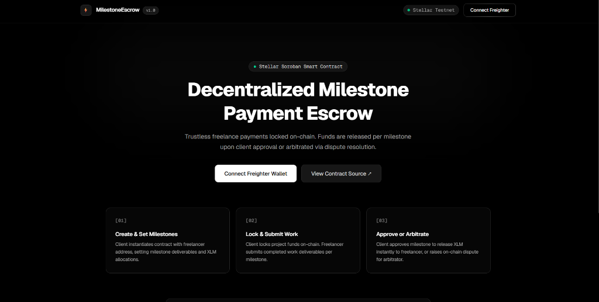
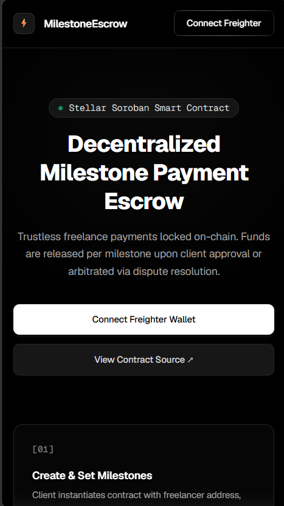
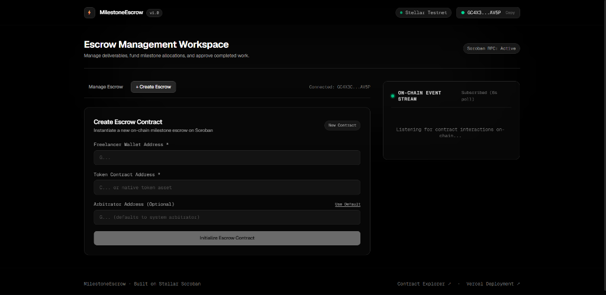
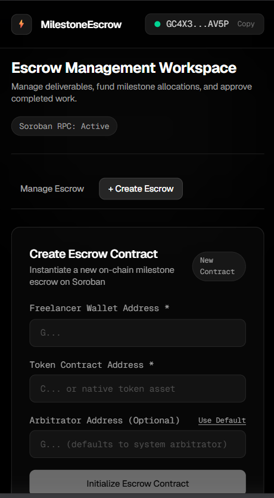

# Freelancegig Milestone-Payment Escrow dApp (Rust / Stellar Soroban)

[](https://github.com/ElonCoding/Freelancegig-milestone-payment-escrow/actions/workflows/rust-contracts.yml)
[](https://github.com/ElonCoding/Freelancegig-milestone-payment-escrow/actions/workflows/frontend.yml)
[](https://freelancegig-milestone-payment-escr-psi.vercel.app)

Production-grade decentralized milestone payment escrow dApp built on **Stellar Soroban** using **Rust** smart contracts and **Next.js 16**.

🚀 **Live Production App**: [https://freelancegig-milestone-payment-escr-psi.vercel.app](https://freelancegig-milestone-payment-escr-psi.vercel.app)

---

## Overview

Freelancegig Escrow allows clients and freelancers to establish trustless, milestone-based contracts on-chain. Funds are safely locked in a Soroban smart contract, released per milestone upon client approval, or arbitrated via dispute resolution.

---

## Responsive UI Showcase

### 1. Landing Page (Desktop & Mobile)

<p align="center">
  
</p>
<p align="center">
  
</p>

---

### 2. Connected Escrow Workspace (Desktop & Mobile)

<p align="center">
  
</p>
<p align="center">
  
</p>

---

## Architecture Diagram

```
+-------------------------------------------------------------------------+
|                           NEXT.JS 16 FRONTEND                           |
|  +---------------------+   +---------------------+  +-----------------+ |
|  | Freighter Wallet UI |   |  Escrow Dashboard   |  | Event Feed UI   | |
|  +----------+----------+   +----------+----------+  +--------+--------+ |
+-------------|-------------------------|----------------------|----------+
              | Wallet Sign             | Read/Write RPC       | Event Poll
              v                         v                      v
+-------------------------------------------------------------------------+
|                         STELLAR SOROBAN TESTNET                         |
|                                                                         |
|   +-----------------------------------------------------------------+   |
|   |                  EscrowContract (Rust / WASM)                   |   |
|   |  - create_escrow()          - add_milestone()                   |   |
|   |  - fund_escrow()            - submit_milestone()                |   |
|   |  - approve_milestone()      - raise_dispute()                   |   |
|   |  - resolve_dispute()        - cancel_escrow()                   |   |
|   |                                                                 |   |
|   |  * Indexed Events: env.events().publish(...)                    |   |
|   |  * Error Handling: Custom EscrowError Enum                      |   |
|   |  * Access Control: Strict Auth Check via Address::require_auth()|   |
|   +-----------------------------------------------------------------+   |
+-------------------------------------------------------------------------+
```

---

## Tech Stack

- **Smart Contract Layer**: Rust 2021 Edition, Soroban SDK v25, `wasm32v1-none`
- **Frontend Layer**: Next.js 16 (App Router), React 19, TypeScript, Tailwind CSS v4
- **Wallet & Client Integration**: `@stellar/freighter-api`, `@stellar/stellar-sdk`, Soroban JS Contract Client
- **Deployment**: Vercel (`freelancegig-milestone-payment-escr-psi.vercel.app`)
- **CI/CD**: GitHub Actions (`rust-contracts.yml`, `frontend.yml`)

---

## Key Features

- ✅ **Milestone Payment Lifecycle**: Pending → Submitted → Approved → Released (or Disputed / Refunded).
- ✅ **Arbitration & Dispute Resolution**: On-chain dispute logging and arbitrator payout resolution.
- ✅ **Custom `EscrowError` Enum**: Strongly-typed errors preventing panics (`Unauthorized`, `InvalidAmount`, `NotFunded`, etc.).
- ✅ **Indexed On-Chain Events**: Contract logs published via `env.events().publish(...)` for real-time frontend streaming.
- ✅ **Real-Time Event Stream**: Live Activity Feed component tracking contract interactions via RPC.
- ✅ **Freighter Wallet Integration**: Connect/disconnect flow, network checking, signed transaction submission.
- ✅ **Mobile Responsive UI**: Styled for 375px (mobile), 768px (tablet), and 1024px+ (desktop).

---

## Deployed Contract & App Links

- **Live Frontend App**: [https://freelancegig-milestone-payment-escr-psi.vercel.app](https://freelancegig-milestone-payment-escr-psi.vercel.app)
- **Network**: Stellar Testnet
- **RPC Endpoint**: `https://soroban-testnet.stellar.org`
- **Contract Address**: [`CAQHJS675URVDAIMTGGCQ24AFKWSCOGQINWFZF2OS6KHHSJDYKAIQFA4`](https://stellar.expert/explorer/testnet/contract/CAQHJS675URVDAIMTGGCQ24AFKWSCOGQINWFZF2OS6KHHSJDYKAIQFA4)
- **Stellar Expert Explorer**: [View Deployed Contract on Stellar Expert](https://stellar.expert/explorer/testnet/contract/CAQHJS675URVDAIMTGGCQ24AFKWSCOGQINWFZF2OS6KHHSJDYKAIQFA4)

---

## Setup & Installation

### Prerequisites
- **Rust**: 1.75+ with `wasm32-unknown-unknown` target
- **Node.js**: 20+
- **Freighter Wallet**: Browser Extension set to **Testnet**

### 1. Clone Repository
```bash
git clone https://github.com/ElonCoding/Freelancegig-milestone-payment-escrow.git
cd Freelancegig-milestone-payment-escrow
```

### 2. Smart Contract Build & Test
```bash
cd contract
cargo build --target wasm32-unknown-unknown --release
cargo test
```

### 3. Frontend Setup & Local Server
```bash
cd ../client
npm install
npm run dev
```
Open **http://localhost:3000** in your browser.

---

## Smart Contract Unit Tests

12 comprehensive Rust unit tests covering all execution paths:

```text
running 12 tests
test test::test_create_and_fund_project ... ok
test test::test_submit_work_and_approve ... ok
test test::test_release_funds ... ok
test test::test_dispute_flow_freelancer_wins ... ok
test test::test_dispute_flow_client_wins ... ok
test test::test_access_control_unauthorized_approve ... ok
test test::test_access_control_unauthorized_submit ... ok
test test::test_access_control_unauthorized_dispute_resolve ... ok
test test::test_zero_amount_milestone_fails ... ok
test test::test_double_funding_fails ... ok
test test::test_cannot_approve_unsubmitted_milestone ... ok
test test::test_cancel_project_and_refund ... ok

test result: ok. 12 passed; 0 failed; 0 ignored; 0 measured
```

---

## Repository Structure

```
.
├── .github/
│   └── workflows/
│       ├── frontend.yml         # Frontend build & lint CI workflow
│       └── rust-contracts.yml   # Soroban Rust contract build & test CI workflow
├── contract/
│   ├── Cargo.toml               # Workspace Cargo configuration
│   └── contracts/
│       └── contract/
│           ├── Cargo.toml
│           └── src/
│               ├── lib.rs       # Single-file unified Rust escrow contract
│               └── test.rs      # 12 comprehensive unit tests
├── client/
│   ├── src/
│   │   ├── app/
│   │   │   └── page.tsx         # Responsive dashboard homepage
│   │   ├── components/
│   │   │   ├── EscrowDashboard.tsx
│   │   │   ├── EventFeed.tsx   # Real-time event stream
│   │   │   └── Navbar.tsx      # Freighter wallet button
│   │   └── hooks/
│   │       └── contract.ts     # Soroban RPC & wallet interface
│   └── package.json
├── deployed_addresses.json      # Deployed contract metadata
└── README.md
```

---

## License

MIT
